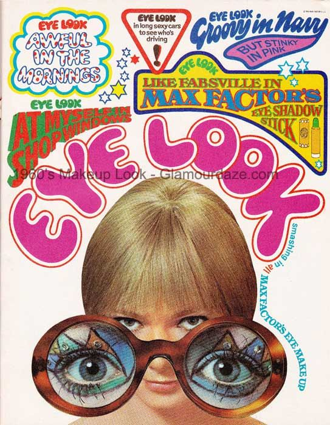

# Analisis Crítico Campos Paloma

Lo que espero contar con este proyecto es si el Festival de Viña del Mar ha funcionado, en sus más de sesenta años de historia, como un salto de popularidad para los artistas que se presentan. Mi objetivo es revelar si la visibilidad que otorga el escenario más importante de Chile se traduce en un aumento real de reproducciones, ventas y presencia internacional, o si, por el contrario, los artistas llegan a Viña sólo cuando ya tienen un éxito consolidado. 

Quiero mostrar qué tan cierto es la idea que tienen los adultos o abuelitos de que “Viña hace famosos a los artistas”, comparando trayectorias de figuras que comenzaron en la competencia internacional y luego regresaron como estrellas, frente a aquellas que ya tenían renombre mundial antes de llegar al festival.

El impacto que espero generar es abrir una discusión cultural sobre el rol de Viña como vitrina para mostrar a la audiencia cantantes emergentes, y que esta actividad es un respaldo de éxito dentro del mundo musical. Además, quiero ver como podemos analizar como un medidor de éxito, pero con datos concretos. Muchas veces hablamos del festival desde la memoria, la nostalgia o la polémica, pero pocas veces se analiza con evidencia si efectivamente cambia el destino de los músicos. 

Busco aportar una mirada crítica que permita comprender cómo este evento televisivo ha influido en las carreras, en la percepción del público chileno y latinoamericano, y en la validación de ciertos géneros musicales frente a otros. Que este proyecto sirva como un registro histórico y analítico que complemente las lecturas anecdóticas ya existentes, mostrando a Viña como un fenómeno cultural y de industria.

Mis ideas para este proyecto, junto con las que redactamos en el primer informe, sería realizar algo muy icónico de cada generación y cantante. Me gusta mucho el área digital, así que espero realizar un trabajo que resalte y sea llamativo. Que más allá de que el contenido que veamos sea solo números densos, revisarlo pueda ser ameno para el que quiera leerlo. 

1. Letras referentes a la época, que distingan cada una de las décadas del festival. En el ejemplo, década 2010 y 80´s

2. Paleta de colores llamativa y continua, con un color de fondo fijo. Ejemplo, seguir los colores brillantes de los 80 y variar solo los dibujos. 

Ejemplo en The Pudding: 
https://pudding.cool/2024/07/scifi/

3. Rankings y estadisticas en elementos de la época, que resalten de manera interactiva (se complementa con la idea de Edel y el ejemplo anterior en The Pudding)

