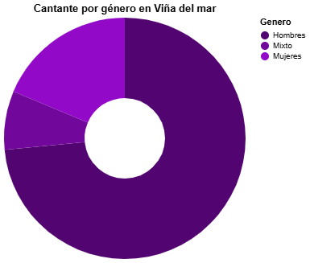

# Crónica 

## La vitrina que también refleja una brecha

El Festival Internacional de la Canción de Viña del Mar no solo ha sido, durante más de seis décadas, el escenario donde artistas de toda América Latina y el mundo buscan consolidar sus carreras y darse a conocer a un público internacional más amplio. También es un espacio que refleja, año tras año, las tendencias, gustos y desigualdades que existen dentro de la industria musical.

Desde la Quinta Vergara, frente a miles de personas y millones de televidentes, se han construido historias que marcan carreras. Uno de los mayores ejemplos de esto es Shakira, quien se presentó por primera vez en la Competencia Internacional del Festival de Viña del Mar y años más tarde volvió a pisar el escenario viñamarino como una artista consolidada y muy respetada dentro de la industria. También está el recordado caso de Luis Miguel que con 14 años se paró frente al "mounstro" y conquistó a miles de personas; lo que marcó solo el inicio de su exitosa carrera. Pero el festival también ha sido testigo de tropiezos difíciles de borrar, como el recordado paso de Maroon 5, que quedó grabado en la memoria colectiva chilena por su desastroso show y la fría actitud de su vocalista.

Viña del Mar tiene ese poder: llevar a lo más alto o derribar la carrera de los artistas que no logran conquistar al público. Es una vitrina, pero también una lupa. Y cuando se analizan los datos de los más de 800 artistas que han pasado por su escenario desde su creación en 1960, se revelan más cosas que historias individuales, se muestra un patrón.

Según los datos recopilados, aproximadamente el 73% de los artistas que se han presentado en Viña son hombres, mientras que solo el 19% corresponde a mujeres y solo un 8% a agrupaciones mixtas. Estos números dejan la situación clara: existe una brecha de género en el festival que no es menor, y aunque en los últimos años se han hecho esfuerzos por diversificar su parrilla, la desigualdad sigue siendo evidente.

Esta diferencia pone sobre la mesa una nueva forma de ver el rol del festival. Si Viña del Mar es una vitrina capaz de proyectar carreras artísticas, ¿a quiénes ha puesto realmente bajo los reflectores? Los números muestran que la visibilidad histórica ha estado concentrada principalmente en artistas masculinos, mientras que las mujeres y agrupaciones mixtas ocupan una presencia menor dentro del evento.

Esa tendencia lleva a pensar que la vitrina de Viña no solo muestra, sino que también selecciona: define qué voces son amplificadas y cuáles quedan en segundo plano, dándole más espacio a un género por sobre otro. En un escenario donde cada presentación puede marcar un antes y un después, esa desigualdad se vuelve parte de la historia.

La tendencia, sin embargo, parece estar cambiando lentamente. En las últimas ediciones se ha visto un esfuerzo por incluir más voces femeninas y proyectos diversos: desde Mon Laferte y Denise Rosenthal, hasta artistas urbanas como Princesa Alba o Paloma Mami, quienes también representan nuevas formas de entender el éxito musical. Pero la proporción sigue siendo desigual, y eso plantea una pregunta inevitable: ¿de qué tipo de vitrina estamos hablando si no todos son invitados a participar en ella?

El Festival de Viña del Mar es, sin duda, una plataforma mediática que puede catapultar carreras (o en el peor de los casos undirlas). Pero el análisis de los datos invita a repensar a quiénes les ha dado históricamente esa oportunidad y a quiénes no. Detrás de los aplausos, las gaviotas y las luces, los números cuentan otra historia: una donde el brillo del escenario aún no ilumina a todos por igual.